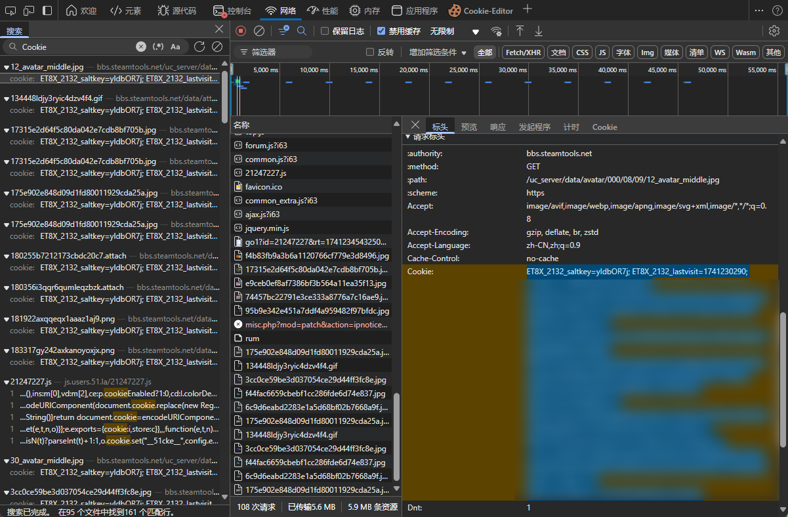
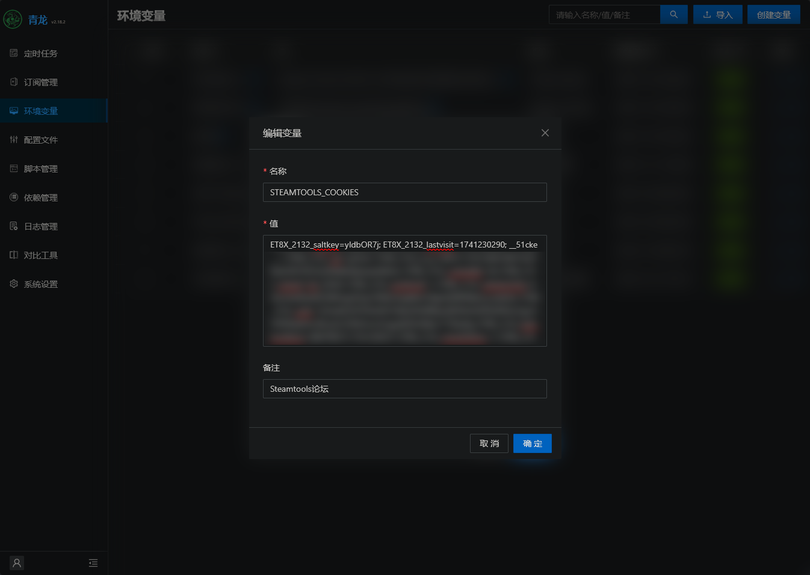

## 说明

为SteamTools论坛 <https://bbs.steamtools.net> 实现定时签到

## 环境变量

1. `STEAMTOOLS_COOKIES`：[SteamTools论坛](https://bbs.steamtools.net/) Cookies

## Cookie获取

1. **打开开发者工具**
   - 右键点击网页空白处，选择 **“检查”**，或者使用快捷键：`Ctrl+Shift+I` (Windows) 或 `Cmd+Option+I` (Mac)。

2. **切换到网络选项卡**
   - 在开发者工具中，找到并点击 **“网络”** (Network) 标签。

3. **刷新网页**
   - 按下 `F5` 或者点击刷新按钮。

4. **搜索 Cookie 信息**
   - 按快捷键 `Ctrl+F` (Windows) 或 `Cmd+F` (Mac)，输入 **“Cookie:”**。

5. **定位并复制 Cookie**
   - 左键双击搜索到的结果，跳转到相关内容。
   - 选中 Cookie 的值，复制后粘贴到对应的环境变量中。

